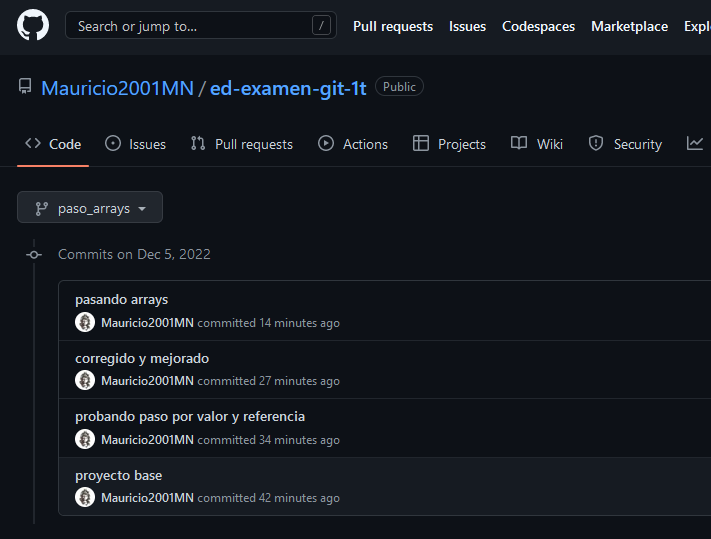

# Entornos de Desarrollo - Examen 1T

1. Creación de un proyecto de IntelliJ con repositorio Git y código de ejemplo.


2. Primer commit en master.


```bash

$ git commit -m "proyecto base"
$ git push -u origin master

```

3. Creamos y desarrollamos la rama valor_referencia.


```bash

$ git branch valor_referencia
$ git checkout valor_referencia

```

4. Hacemos un push de la rama valor_referencia.


```bash

$ git push -u origin valor_referencia

```


5. Hacemos un merge de esta rama a master.


```bash

$ git merge valor_referencia

```

6. Creamos una rama paso_arrays y la desarrollamos.


```bash

$ git branch paso_arrays

```




Capturas de la rama

7. Hacemos un merge a master.


8. Creamos las ramas comparando_objetos y comparando_strings y las desarrollamos.

